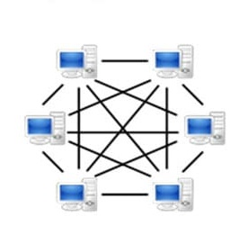
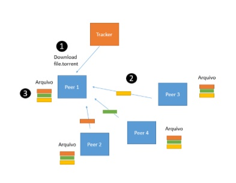
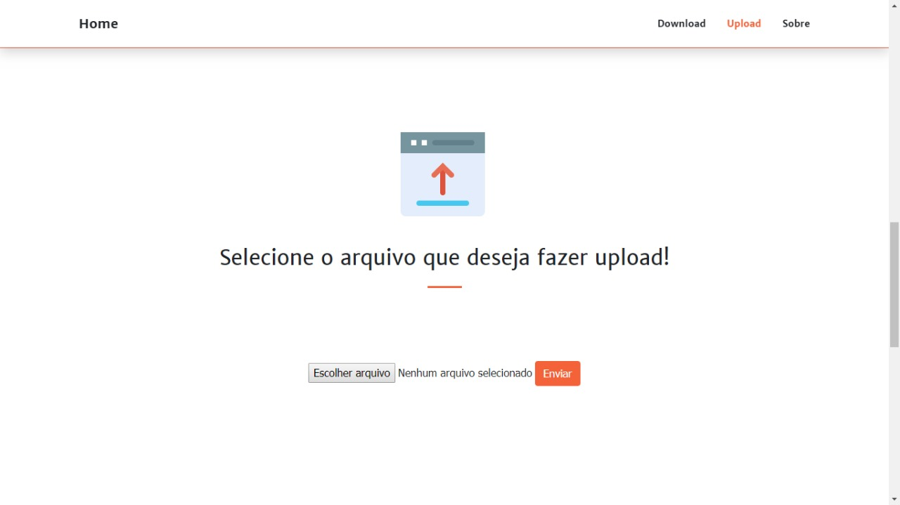

# Sistemas Distribuídos
<p>Segundo Tanenbaum, um sistema distribuído é um conjunto de computadores independentes entre si, e até diferentes, ligados através de uma rede de dados, que se apresentam aos utilizadores como um sistema único e coerente.
</p>

## Exemplos:
- Sistemas de pesquisas (motores de busca)
- Sistemas financeiros
- Jogos Online
- Redes Sociais e plataformas idênticas

# Rede peer-to-peer (P2P)
### O Que é P2P?
<p>P2P significa Peer to Peer e o 2 da sigla é um trocadilho com a palavra to ("para" em inglês), já em português, significa "par a par". O nome se refere ao formato à disposição dos computadores interligados à rede, onde cada computador conectado realiza as funções de cliente e servidor ao mesmo tempo, dessa forma, tudo é descentralizado, sem um único servidor centralizado que detenha o arquivo e precisa se encarregar de enviar todos os milhares de pedidos ao mesmo tempo.

### Ficou complicado entender o que é cliente e servidor? <br/>
Cliente é o nome dado ao pc que pede algo à rede, e servidor aquele que envia o pedido. <br/>
Como não existe um servidor dedicado, veja que nenhum servidor de torrent armazena sequer um arquivo, os arquivos estão em máquinas em qualquer local do mundo. Não há uma única fonte para o seu download (como acontece quando você baixa algo de um site), há milhões de fontes só esperando sua conexão.
</p>

[Oficina da Net](https://www.oficinadanet.com.br/post/14046-o-que-e-p2p-e-como-ela-funciona)

# Rede (P2P) para compartilhamento de arquivos com o conceito de Torrent 
O serviço P2P cria uma rede virtual entre as máquinas conectadas no momento e vasculha o HD do usuário atrás da música, vídeo ou qualquer outro documento que a pessoa esteja baixando.<br/>

O que torna a rede P2P eficiente é que você pode começar a baixar de uma fonte, e no momento em que esta fonte desligar sua máquina e interromper a conexão, o download recomeçará de onde parou, a partir dos dados cedidos por um outro usuário, se este novo usuário também desconectar, o processo se repetirá, <em>ad eternum<em/> (pra sempre), até você completar o download

[Oficina da Net](https://www.oficinadanet.com.br/post/14046-o-que-e-p2p-e-como-ela-funciona)

## Arquitetura geral de uma rede P2P


Mas e como funciona essa coisa de baixar um pouco de um, um pouco de outro, etc. não dá erro? Não, pois neste tipo de conexão, os arquivos a serem transferidos são divididos em pequenos pedaços e então compartilhados. Os pedaços são sempre os mesmos para a música X, ou jogo Y. Funciona assim: Você baixa um desses pedaços de arquivo e, logo após, você imediatamente passa a distribuí-lo aos outros usuários que estão fazendo o download do mesmo arquivo. Assim, evitam-se gargalos na transmissão dos dados e permite que mesmo aquela pessoa com uma conexão lenta de transferência consiga repassar o arquivo para milhares de pessoas. 
[Infowester](https://www.infowester.com/cluster.php)

## REDE (P2P) para compartilhamento de arquivos com o conceito de Torrent  de forma simplificada
O propósito deste presente trabalho é a abordagrm do conceito de redes P2P e Torrentcom a implementação do mesmo, seguindo as seguintes características, implementar um sistema do zero, onde um usuário poderá baixar um arquivo (que deverá ser um pdf, ou um pré-projeto de TCC) que esteja disponível em várias máquinas conectadas na rede. As máquinas da arquitetura devem ser máquinas físicas. (smartphone ou computador). Fara facilitar o entendimento, observe a seguinte figura:  
#### Arquitetura aplicada neste trabalho


A arquitetura possui um servidor chamado de Tracker, que simplesmente armazena um arquivo .torrent que contêm os seguintes dados:  
1. O nome de um arquivo a ser baixado (ex: tcc_maria_2018.pdf) 
2. Em quais peers este arquivo está presente, 
3. O tamanho (em número de palavras) de cada bloco do arquivo a ser baixado 
4. Um código hash MD5 referente ao conteúdo do arquivo. O pdf não possuirá nem figuras e nem tabelas, apenas texto. Os blocos podem ser as seções padrão do documento ou o grupo pode fazer algo mais elaborado, trabalhando com outra forma de quebra do arquivo.  

As etapas do processo de download são:  
1) O peer requerente deve baixar o arquivo torrent 
2) O peer requerente deve identificar o quão longe cada peer está para poder decidir qual bloco do arquivo pdf irá baixar daquele peer em questão. Blocos menores devem ser baixados de peeers mais distantes. Este teste de latência pode ser o resultado de um simples ping ou outra alternativa mais elaborada.
3) Por fim, o peer requerente já com o arquivo baixado deve verificar se o arquivo está completo, através de um código hash, localizado no arquivo torrent. 

#### Arquitetura "" aplicado neste trabalho

## Segurança

A segurança em uma rede peer-to-peer não é uma caracteristica predominante. Assim se sua organização tiver preocupações em matéria de segurança a decisão deve ser para algo que sua organização pode controlar (como um servidor). Uma vez que os usuários vão  necessitar fazer o compartilhamento do acesso a pastas, eles podem optar por não exigir senhas. Esta falta de hierarquia tem um impacto enorme sobre a segurança da rede e sua organização precisará de uma formação adequada para seus usuários para evitar problemas.

#### Representação do sistema "" e modelo base.


## Arquitetura geral do Sistema Torrent


## Quebra de arquivos em blocos de bytes


## hash para verificar a integridade
Função ping para o peer requerente deve identificar o quão longe cada peer está para poder decidir qual bloco do arquivo pdf irá baixar daquele peer em questão. Este teste de latência pode ser o resultado de um simples ping como mostrado abaixo:
a = requests.head
print(a.elapsed)

## Telas:
##### Tela Requerente - Home.

##### Tela Requerente > Upload de arquivos.

##### Tela Requerente > Download dos arquivos.


## Bibliografia:

```LateX
@misc{prototypep2p,
 title   = {A prototype network p2p},
 url     = {https://github.com/TiagoOlivv/prototype-network-p2p/},
 organization={AbnTeX},
 urlaccessdate={4 jun. 2019}
}
```
```LateX
Use \cite{prototypep2p}
```
