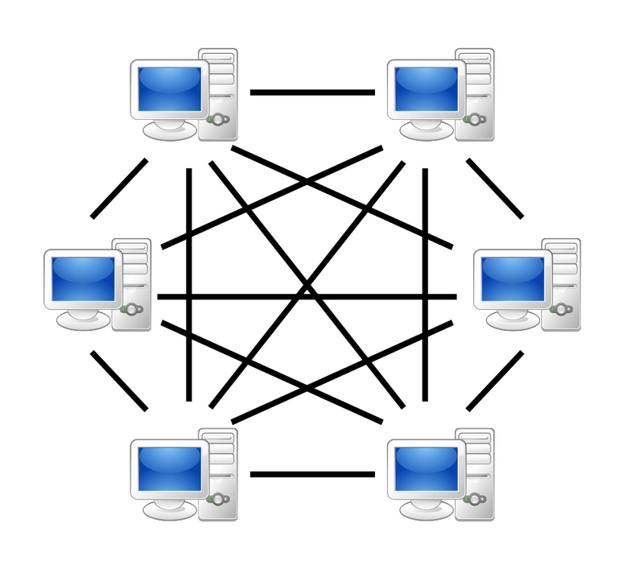
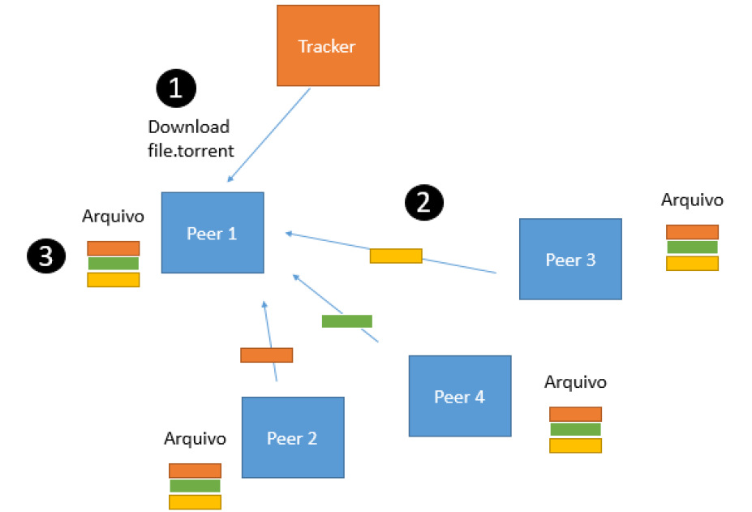
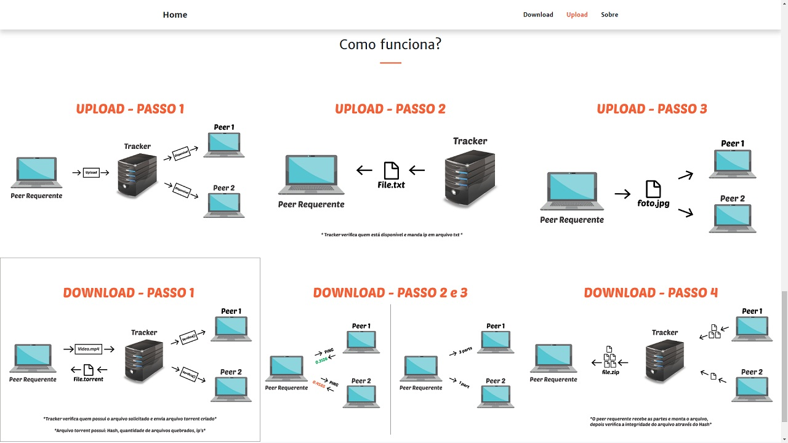
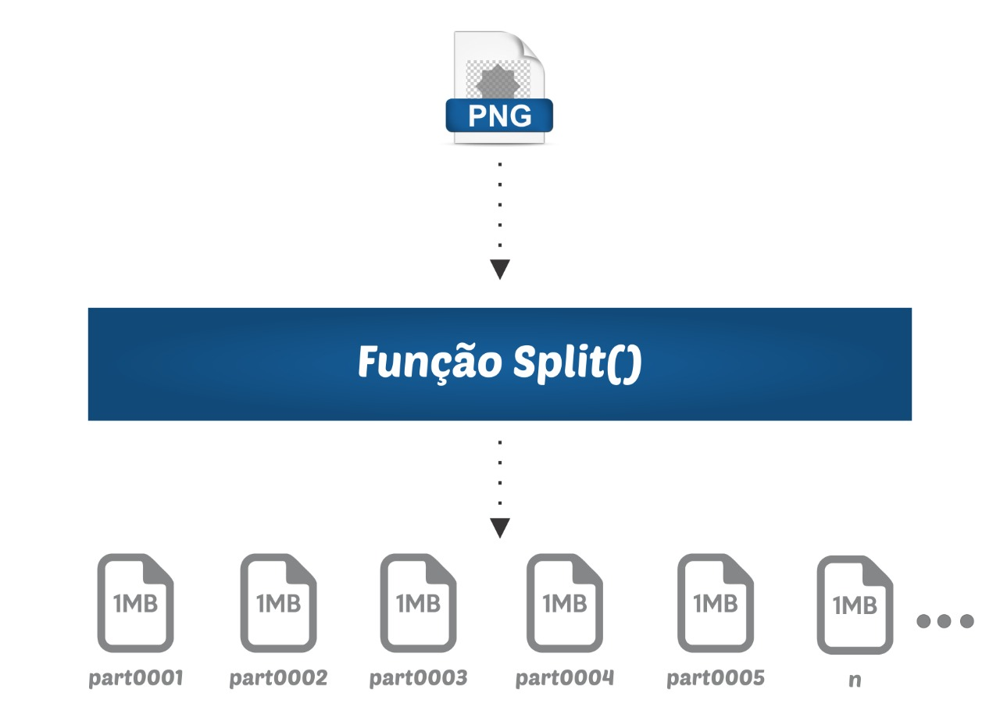
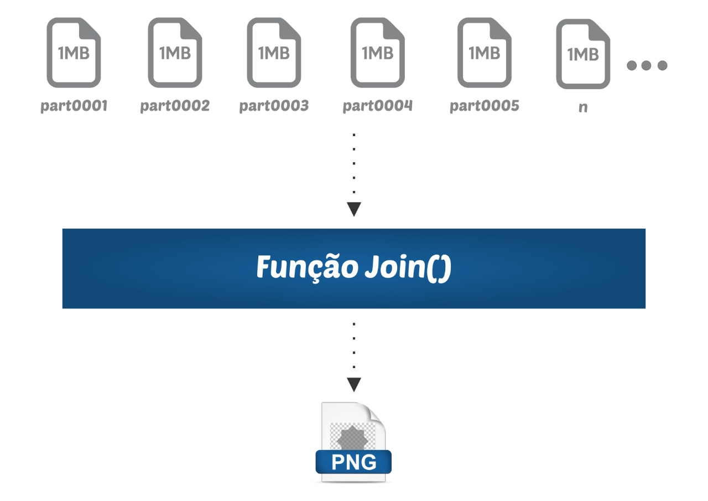

# Sistemas Distribuídos
<p>Segundo Tanenbaum, um sistema distribuído é um conjunto de computadores independentes entre si, e até diferentes, ligados através de uma rede de dados, que se apresentam aos utilizadores como um sistema único e coerente.
</p>

<strong>Exemplos:</strong>
- Sistemas de pesquisas (motores de busca);
- Sistemas financeiros;
- Jogos Online;
- Redes Sociais e plataformas idênticas.

# Rede peer-to-peer (P2P)
<strong>O Que é P2P?</strong><br/>
P2P significa Peer to Peer e o 2 da sigla é um trocadilho com a palavra to ("para" em inglês), já em português, significa "par a par". O nome se refere ao formato à disposição dos computadores interligados à rede, onde cada computador conectado realiza as funções de cliente e servidor ao mesmo tempo, dessa forma, tudo é descentralizado, sem um único servidor centralizado que detenha o arquivo e precisa se encarregar de enviar todos os milhares de pedidos ao mesmo tempo.

<strong>Ficou complicado entender o que é cliente e servidor? </strong><br/>
Cliente é o nome dado ao pc que pede algo à rede, e servidor aquele que envia o pedido. <br/>
Como não existe um servidor dedicado, veja que nenhum servidor de torrent armazena sequer um arquivo, os arquivos estão em máquinas em qualquer local do mundo. Não há uma única fonte para o seu download (como acontece quando você baixa algo de um site), há milhões de fontes só esperando sua conexão.
[Oficina da Net](https://www.oficinadanet.com.br/post/14046-o-que-e-p2p-e-como-ela-funciona)

# Rede P2P para compartilhamento de arquivos
O serviço P2P cria uma rede virtual entre as máquinas conectadas no momento e vasculha o HD do usuário atrás da música, vídeo ou qualquer outro documento que a pessoa esteja baixando.<br/>

O que torna a rede P2P eficiente é que você pode começar a baixar de uma fonte, e no momento em que esta fonte desligar sua máquina e interromper a conexão, o download recomeçará de onde parou, a partir dos dados cedidos por um outro usuário, se este novo usuário também desconectar, o processo se repetirá, <em>ad eternum </em> (pra sempre), até você completar o download. [Oficina da Net](https://www.oficinadanet.com.br/post/14046-o-que-e-p2p-e-como-ela-funciona)

# Arquitetura geral de uma Rede P2P
<p align="center">
  
</p>

<strong>Como funciona essa coisa de baixar um pouco de um, um pouco de outro, etc. não dá erro?</strong> <br/> 
Não, pois neste tipo de conexão, os arquivos a serem transferidos são divididos em pequenos pedaços e então compartilhados. Os pedaços são sempre os mesmos para a música X, ou jogo Y. <br/>

<strong>Funcionamento:</strong> Você baixa um desses pedaços de arquivo e, logo após, você imediatamente passa a distribuí-lo aos outros usuários que estão fazendo o download do mesmo arquivo. Assim, evitam-se gargalos na transmissão dos dados e permite que mesmo aquela pessoa com uma conexão lenta de transferência consiga repassar o arquivo para milhares de pessoas. 
[Oficina da Net](https://www.oficinadanet.com.br/post/14046-o-que-e-p2p-e-como-ela-funciona)

# Rede P2P para compartilhamento de arquivos abordada no seguinte trabalho  
O propósito deste presente trabalho é a abordagrm do conceito de redes P2P e Torrent com a implementação do mesmo, seguindo as seguintes características:
- Implementação de um sistema, onde um usuário poderá baixar um arquivo que esteja disponível em várias máquinas conectadas na rede. 
As máquinas da arquitetura devem ser máquinas físicas. Fara facilitar o entendimento, observe a seguinte figura:  

<p align="center">
  
</p>

A arquitetura possui um servidor chamado de Tracker, que simplesmente armazena um arquivo .torrent que contêm os seguintes dados:  
1. O nome de um arquivo a ser baixado (ex: arquivo.pdf);
2. Em quais peers este arquivo está presente;
3. O número blocos em que o arquivo foi divido do arquivo para ser baixado;
4. Um código hash MD5 referente ao conteúdo do arquivo. 

As etapas do processo de download são:  
1. O peer requerente baixa o arquivo torrent; 
2. O peer requerente identifica o quão longe está cada peer, para poder decidir quantas partes do arquivo solicitado irá baixar daquele peer em questão. Menores quantidades são baixados de peeers mais distantes. A distância do peer requerente para os peers é medida a partir de um teste de latência (tempo que leva para um pacote de dados ir de um ponto designado para o outro);
3. Por fim, o peer requerente já com o arquivo baixado verifica a integridade do arquivo, através de um código hash, localizado no arquivo torrent. 

### Instruções de uso:
#### Aplicação feita em python 3
1. instalar as bibliotecas necessárias (pip install -r requirements.txt);
2. Executar o peer, peer requerente e o tracker;
3. Configurar os arquivos .txt de acordo com o IP e porta que os programas estão sendo executados;
4. Acessar o IP e Porta em que o peer requerente está sendo executado; 
5. enjoy.

# Telas:
##### Tela Requerente - Home.

##### Tela Requerente > Upload de arquivos.

##### Tela Requerente > Download dos arquivos.

##### Tela Requerente > Sobre.


## Representação da função de quebra do arquivo em bytes </br>
<p align="center">
  
</p>

<p align="center">
  
</p>

### Representação da função de verificação da integridade do arquivo (hash) </br>
<p align="center">
  
</p>

# Arquitetura geral do Sistema P2P proposto
<p align="center">
  
</p>


```LateX
@misc{prototypep2p,
 title   = {A prototype network p2p},
 url     = {https://github.com/TiagoOlivv/prototype-network-p2p/},
 organization={AbnTeX},
 urlaccessdate={4 jun. 2019}
}
```
```LateX
Use \cite{prototypep2p}
```
